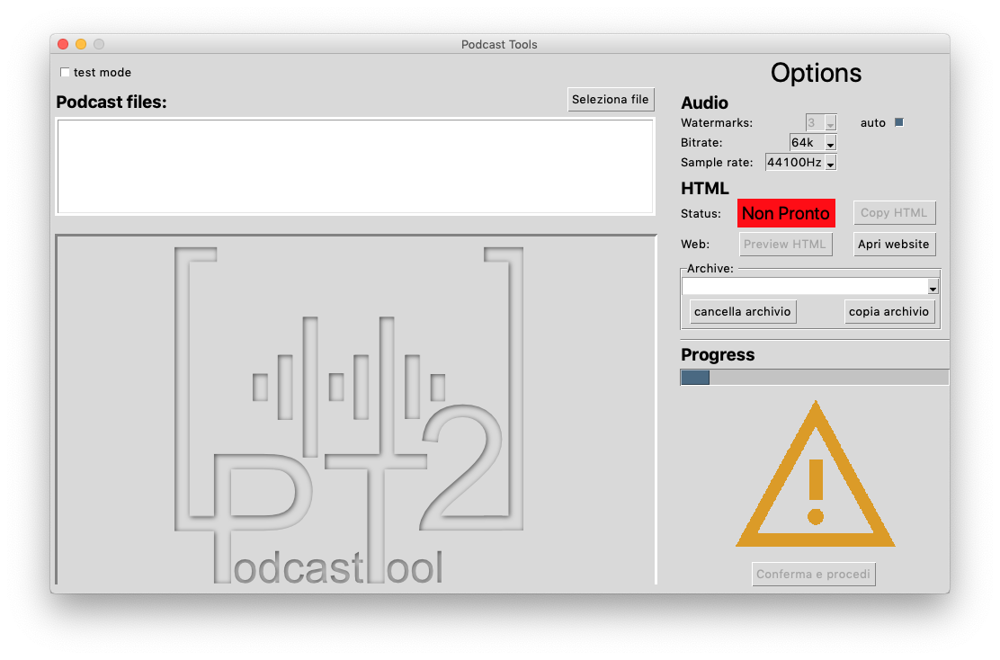

=============
PodcastTool 2
=============

A tool I made for https://www.fonderiesonore.it.

This tool is needed for parsing and uploading podcast files to their platform.
PodcasTool 2 is based on the original PodcastTool, which was written in PHP.
It improves on its predecessor by adding a GUI approach. In addition
it to the visual interaction, it does also improve on the following topics:

- cleaner and documented code base.
- new error helper for the user.
- customizzable audio options for user.
- ability to create/modifiy the custom audio theme of the podcast introduction.
- Linux and MacOS support.

Description
===========

The use of this script is made for a specific workflow, therefore it not usable
for other purposes.

Install on Linux-Ubuntu:

[Update] Download/Compile standalone:

PodcastTool can now be downloaded or compiled as a (almost) standalone package
from the github page.
The app only requires ``ffmpeg`` and ``xsel`` to be installed.
The version on which the app is build matters.
e.g building on Ubuntu 17.10 wont work on Ubuntu 19.04 and vice-versa.

To compile the standalone app ``pyinstaller`` is needed.
Then just run the ``build_linux.sh`` script in ``include/scripts`` folder.
This will create a standalone package in the home directory. The app includes
a script to create a ``.desktop`` file shortcut inside ``include/scripts``.
This will automatically create a .desktop file and place it in the
``/usr/share/applications`` folder.

In order to use the script on Linux platform there must be several steps to
take before. A bash script will be provided for a quick setup, but to
summarize:

The script needs the following packages. All of them are availibale to install
thru the `sudo apt install command`:

    * ``python3.7``
    * ``python3-tk``
    * ``python3-pip``
    * ``libpython3.7-dev``
    * ``git``
    * ``ffmpeg``
    * ``xsel``

To launch the setup script that in the terminal

        bash setup_podcast.sh

The script will install all of the packages, download the repo and assign
a couple of aliases for updating the repo if necessary and other utility.
If something went wrong with the installation and not everything was installed,
there will be a log file to check for the report.

A new file will be created on the Desktop.

Once the script gui started you will have the following window

Note
====

This project has been set up using PyScaffold 3.1. For details and usage
information on PyScaffold see https://pyscaffold.org/.
